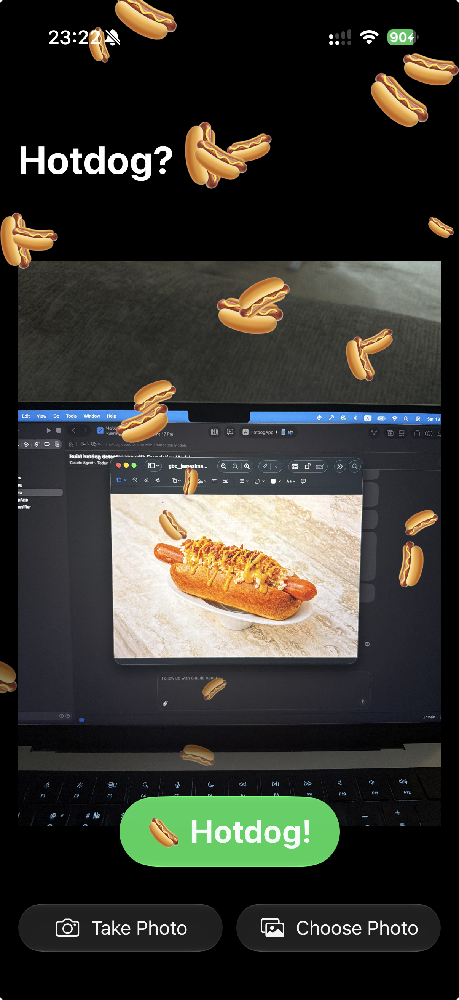

# HotdogApp

Silicon Valley's iconic "Hotdog or Not Hotdog" detector — built with Apple's on-device Foundation Models (iOS 27).

<p align="center">
  
</p>

## Features

- Take a photo with the camera or pick from your library
- On-device AI classification using Foundation Models — no server, no data leaves your device
- Hotdog confirmed: 🌭 confetti explosion
- Not a hotdog: 🚫 politely informed
- Liquid Glass UI (iOS 27)

## Requirements

- iOS 27+
- Apple Intelligence enabled on device (Settings → Apple Intelligence & Siri)
- Xcode 27+

## How it works

1. User picks or shoots a photo
2. Photo is sent to a `LanguageModelSession` with a `@Generable` structured output type:

```swift
@Generable
struct HotdogResult {
    @Guide(description: "true if the image contains a hotdog, false otherwise")
    var isHotdog: Bool
}
```

3. The model returns a guaranteed `Bool` — no string parsing
4. Result is shown as a Liquid Glass badge overlaid on the photo

## Project structure

| File | Role |
|------|------|
| `HotdogClassifier.swift` | Foundation Models session + `@Generable` result type |
| `ContentView.swift` | Main UI — photo card, glass buttons, result badge |
| `CameraView.swift` | `UIImagePickerController` wrapped for SwiftUI |
| `ConfettiView.swift` | Hotdog emoji particle system for the win state |

## Author

Artem Novichkov, https://artemnovichkov.com
